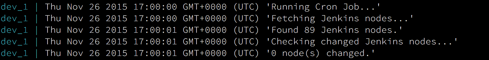

# Jenkins Monitor

[](https://app.wercker.com/project/bykey/6b1943c59a2f5b55beac66aa0f90d346)
[](https://david-dm.org/Starefossen/jenkins-monitor)
[](https://webchat.freenode.net/?channels=node-build)


Jenkins Monitoring and Alert solution build to monitor the official Node.js CI
server operated by [nodejs/build](https://github.com/nodejs/build).



## Prerequisite

* Docker >= v1.8
* Docker Compose >= 1.3

## Environment

* `CRON_INTERVAL` - how often to run checks (ex. `0 0 */1 * * *`)
* `OFFLINE_THRESH` - how many times offline befor notifying

**Jenkins:**

* `JENKINS_URL` - Jenkins Server URL to monitor
* `JENKINS_USER` - Jenkins user name
* `JENKINS_AUTH` - Jenkins user auth token

**IRC:**

* `IRC_CHANNEL` - IRC channel to post to
* `IRC_SERVER` - IRC server to post to
* `IRC_USER` - IRC user to post as

**Gitter:**

* `GITTER_WEBHOOK_URL` - Gitter Webhook URL

**Sendgrid:**

* `SENDGRID_USERNAME` - Sengrid email notification user name
* `SENDGRID_PASSWORD` - Sendgrid email notification password
* `SENDGRID_RECIPIENTS` - Sendgrid email notification recipients (comma separated)
* `SENDGRID_SENDER` - Sendgrid email notification sender

## Test

```
npm test
npm run lint
```

## Start (dev)

```
npm start
```

## [MIT Licensed](https://github.com/Starefossen/jenkins-monitor/blob/master/LICENSE)
